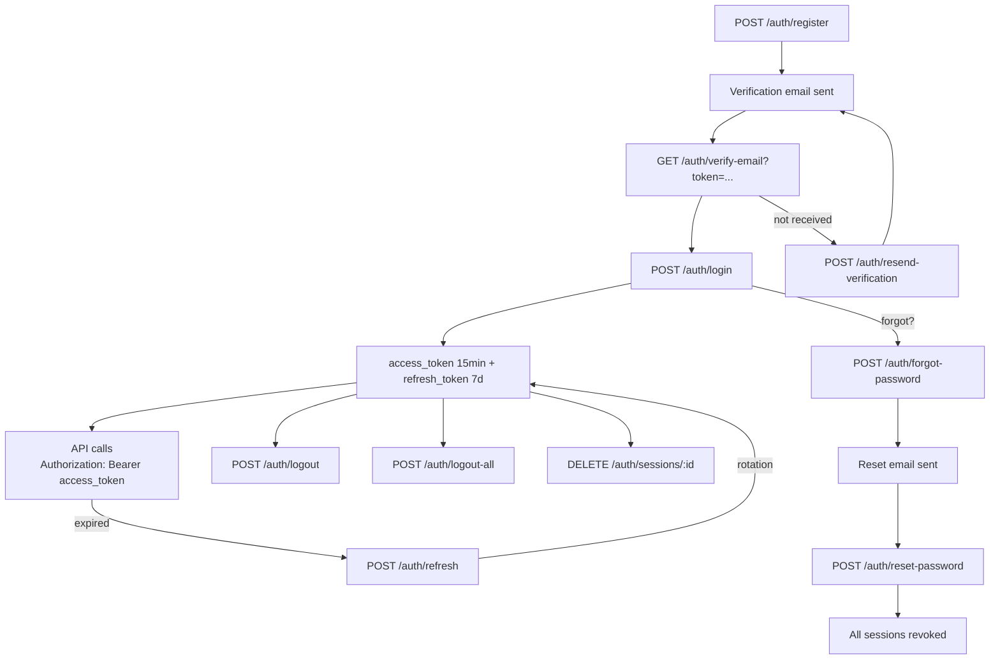

# linked-me API


API REST pour la plateforme linked-me.

## Table of contents

- [Getting started](#getting-started)
- [Scripts](#scripts)
- [Testing](#testing)
- [API Documentation](#api-documentation)
- [Authentication](#authentication)
- [Rate Limiting](#rate-limiting)
- [Architecture](#architecture)
- [Cron Jobs](#cron-jobs)
- [Pagination](#pagination)
- [Deployment](#deployment)
- [Git flow](#git-flow)

## Getting started

### Prerequisite

- Node.js 22+
- PostgreSQL 17

### Installation

```bash
npm install
```

### Configuration

Copy `.env.example` to `.env` and fill in the values:

```bash
cp .env.example .env
```

| Variable | Description |
|----------|-------------|
| `DATABASE_URL` | PostgreSQL connection URL |
| `JWT_SECRET` | Secret key for JWT tokens |
| `JWT_ACCESS_EXPIRY` | Access token lifetime (default: `15m`) |
| `JWT_REFRESH_SECRET` | Secret key for refresh tokens |
| `JWT_REFRESH_EXPIRY` | Refresh token lifetime (default: `7d`) |
| `PORT` | Server port (default: `3000`) |
| `NODE_ENV` | Environment (`development` / `production`) |
| `APP_URL` | API base URL (used in email links) |
| `FRONTEND_URL` | Frontend URL for password reset links (optional, falls back to `APP_URL`) |
| `MAIL_FROM` | Sender email address (must be verified in Resend) |
| `RESEND_API_KEY` | API key for transactional emails (Resend) |
| `CORS_ORIGIN` | Allowed CORS origin (optional, all origins if unset) |
| `ADMIN_EMAIL` | Initial admin account email |
| `ADMIN_PASSWORD` | Initial admin account password |
| `UNVERIFIED_USER_TTL_HOURS` | Hours before unverified accounts are deleted (default: `24`) |
| `AUDIT_LOG_TTL_DAYS` | Days before audit logs are deleted by the nightly cron (default: `30`) |
| `SWAGGER_ENABLED` | Set to `true` to enable Swagger UI |

### Database

```bash
# Apply migrations
npx prisma migrate dev

# Generate Prisma client (also included in npm run build)
npx prisma generate

# Seed the database (roles, permissions, admin)
npx prisma db seed
```

### Run

```bash
# Development (watch mode)
npm run start:dev

# Production
npm run build
npm run start:prod
```

## Scripts

| Script | Description |
|--------|-------------|
| `npm run build` | Generate Prisma client + compile TypeScript |
| `npm run start:dev` | Start server in watch mode |
| `npm run start:prod` | Start compiled build |
| `npm run prisma:migrate` | Create/apply a migration |
| `npm run prisma:seed` | Seed database (upsert roles, permissions, admin) |
| `npm run prisma:reset` | Full database reset + re-seed |
| `npm run prisma:studio` | Open Prisma Studio (visual DB browser) |
| `npm test` | Run unit tests |
| `npm run test:cov` | Run unit tests with coverage report |
| `npm run test:e2e` | Run E2E tests |

## Testing

Unit tests cover all service-layer business logic with mocked dependencies (Prisma, JWT, Mail).

```bash
# Run unit tests
npm test

# Run tests in watch mode
npm run test:watch

# Generate coverage report (output: coverage/)
npm run test:cov
```

**Coverage:** 95 tests across 8 suites — 100% statement coverage on all services (`auth`, `profiles`, `admin/users`, `admin/roles`, `audit`, `tasks`) and the `paginate` utility.

**Stack:** [jest-mock-extended](https://github.com/marchaos/jest-mock-extended) for type-safe Prisma mocks, `jest.mock()` for external modules (bcrypt, mail).

E2E tests (Phase 2 — requires a dedicated test database) will use Supertest to test HTTP endpoints end-to-end.

## API Documentation

Swagger is available at `/api` when `SWAGGER_ENABLED=true` (disabled by default).

A Postman collection is available in [`docs/`](docs/) for testing all endpoints.

## Authentication

The API uses **JWT Bearer tokens** with refresh token rotation (max 10 active sessions per user).



## Rate Limiting

All endpoints are limited to **60 requests per minute** per IP.
Authentication endpoints (`/auth/login`, `/auth/register`) have a stricter limit: **10 requests per 15 minutes** per IP.
`/auth/resend-verification` is limited to **3 requests per hour** per IP. Exceeding these limits returns a `429 Too Many Requests`.

Access control is based on **RBAC** (Role-Based Access Control):
- Each user has one or more **roles** (USER, ADMIN...)
- Each role has **permissions** (e.g. `realm:admin`, `admin:role:read`, `profile:read`)
- Routes are protected by permission-based guards

## Architecture

```
src/
├── auth/           # Authentication (JWT, guards, decorators, permissions)
├── admin/          # Administration
│   ├── roles/      #   Roles + permissions management
│   └── users/      #   Full user management (with roles)
├── profiles/       # Public user profiles (limited fields)
├── common/         # Shared utilities (pagination, DTOs)
├── mail/           # Email service (Resend)
├── tasks/          # Scheduled tasks (cron jobs + manual trigger endpoints)
├── prisma/         # PrismaModule (service + connection)
├── app.module.ts   # Root module
└── main.ts         # Bootstrap
```

## Cron Jobs

Scheduled tasks run automatically via `TasksModule`:

| Task | Schedule | Action |
|------|----------|--------|
| Cleanup unverified users | Every 6 hours | Deletes unverified accounts older than `UNVERIFIED_USER_TTL_HOURS` |
| Cleanup expired tokens | Daily at 2:00 AM | Deletes expired rows in `refresh_tokens` and `password_resets` |
| Cleanup audit logs | Daily at 3:00 AM | Deletes audit logs older than `AUDIT_LOG_TTL_DAYS` (default: 30 days) |

All tasks can also be triggered manually via `POST /tasks/*` (requires `realm:task` permission).

## Pagination

List endpoints support offset-based pagination with search and filters.

**Query parameters:**

| Parameter | Default | Description |
|-----------|---------|-------------|
| `page` | `1` | Page number |
| `limit` | `20` | Items per page (max 100) |
| `sortBy` | `createdAt` | Sort field |
| `sortOrder` | `desc` | Sort direction (`asc` / `desc`) |
| `search` | — | Text search (depends on endpoint) |

**Response format:**

```json
{
  "data": [...],
  "meta": {
    "page": 1,
    "limit": 20,
    "total": 150,
    "totalPages": 8,
    "sortBy": "createdAt",
    "sortOrder": "desc",
    "search": "john",
    "filters": { "role": "ADMIN" }
  }
}
```

Each endpoint may support additional filters (e.g. `role`, `isEmailChecked` for `GET /admin/users`).

## Deployment

Deployed on **Railway** via push to `master`.

- Build: `npm run build`
- Start: migrations + seed + server (automatic)
- Config: `railway.toml`

## Git flow

- `master` — production (protected, merge via PR only)
- `develop` — integration
- `feature/*` — feature branches from develop

Branch protection rules:
- `master`: PR required, CI must pass, branch must be up to date before merging
- `develop`: PR required, CI must pass

Merge strategy: feature → develop via **squash merge**, develop → master via **merge commit**.

## Author

**Christophe Gasquez** — [GitHub](https://github.com/ChristopheGasquez)
